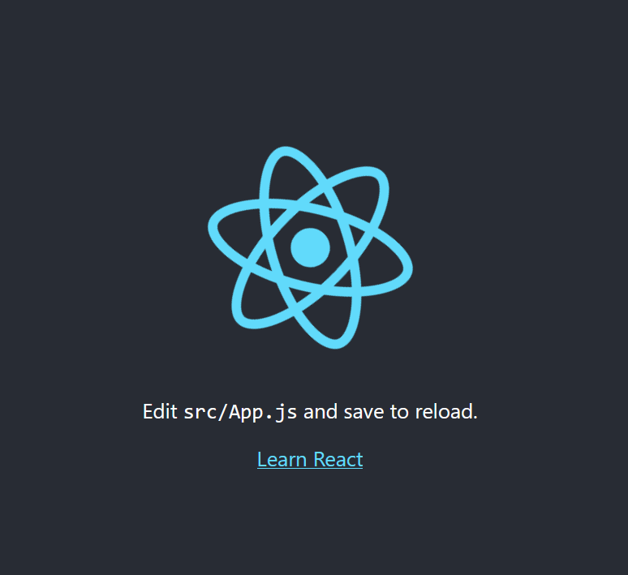

# **React JS**
apa itu react js? jadi react JS bukan merupakan framework melainkan library Javascript untuk membaut aplikasi web atau untk memubat tampilan pada aplikasi web. 
kemudian ada tiga keunggulan utama ketika kita menggunakan react JS.
1. Deklarative (yang berarti pembuatan kode yang mudah dan jelas, sehingga ini berdampak baik agar menjalankan program lebih mudah).
2. Component Based (disini pembuatan web menggunakan react js kita akan fokus pada pembuatan komponen-komponen web yang mana komponen tersebut nantinya akan dipakai pada setiap halaman web yang akan kita buat, nah pada komponen ini mempermudah kita dalam pengembangan terhadap suatu website).
3. Scalable (dapat digunakan pada aplikasi berskala kecil hingga besar dan kompleks).
> selanjutnya. untuk ekstensi yang digunakan pada react JS yaitu JSX.
> kemudian Kenapa kita perlu mempelajari react Js dalam penegmabngan suatu website?
yang pertama selain react Js sudah digunakan oleh facebook dan dikembangkan oleh Facebook developer, react JS juga sudah digunakan oleh beberapa perusahaan ternama  diantaranya adalah microsoft, apple, twitter, Netflix dll. nah ini membuktikan react Js banyak digunakan oleh perusahaan2 besar dunia.

> Cara instalasi React JS :
1. instal node-js
2. Buatlah folder lalu buka dengan CMD  tuliskan perinatah => npx create-react-app [nama-project]
3. Buka folder proyek yang telah dibuat, kemudian jalankan Terminal / CMD pada folder tersebut. lalu lakukan perintah => npm run start
4. dan react js siap jalankan

## React JS
> merupakan component Based yang dapat dibagi menjadi 2 bagian, yaitu class component dan functionanl component.
functional component menulis react JS
- cara 1:

        conts Component = () => {
            return()
        }
        export default Component;
- cara 2:

        function Component () => {
            return()
        }
        export default Component;

## The Virtual DOM
> virtual DOM adalah duplikasi dari real DOM yang sebenarnya. 
> Pada React, setiap bagian dari UI adalah component, dan setiap component mempunyai state. React menggunakan konsep Observable Pattern dan mengamati setiap perubahan pada state. Ketika state pada sebuah component berubah, react mengupadate virtual DOM tree. Setelah virtual DOM diperbarui, React kemudian membandingkan versi sekarang virtual DOM dengan versi sebelumnya. Proses ini sering disebut dengan “diffing”. Setelah mengetahui object pada virtual DOM mana yang berubah maka hanya object tersebutlah yang akan dirubah pada real DOM. Proses seperti membuat performance aplikasi kita lebih baik.