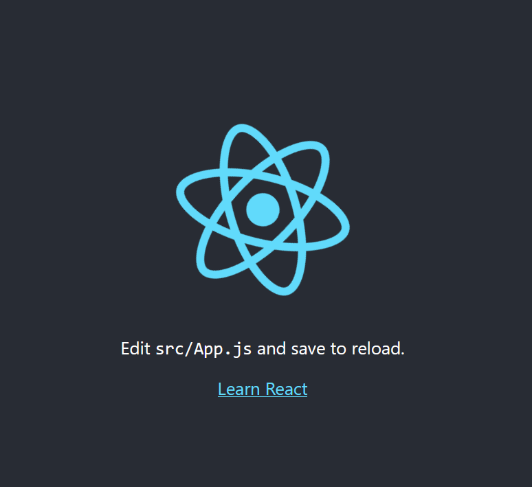

# **React JS**
> React JS adalah framework view library Javascript untuk membuat tampilan (user interface) pada website. react JS membuat aplikasi front-end menjadi lebih cepat walaupun harus menghandle berbagai data. dalam react JS kita dapat menerapkan konsep Modular javascript(React JS membagi 1 tampilan pada website menjadi komponen-komponen kecil). selain itu, React di sebut Scalable (dapat digunakan pada aplikasi berskala kecil hingga besar dan kompleks).
> Cara instalasi React JS :
1. instal node-js
2. Buatlah folder lalu buka dengan CMD => npx create-react-app [nama-project]
3. Buka folder proyek yang telah dibuat, kemudian jalankan Terminal / CMD pada folder tersebut. lakukan perintah => npm run start
4. react js siap jalankan

## React JS
> merupakan component Based yang dapat dibagi menjadi 2 bagian, yaitu class component dan functionanl component.
functional component menulis react JS
- cara 1:

        conts Component = () => {
            return()
        }
        export default Component;
- cara 2:

        function Component () => {
            return()
        }
        export default Component;

## The Virtual DOM
> virtual DOM adalah duplikasi dari real DOM yang sebenarnya. 
> Aturan yang digunakan pada JSX, yaitu:
1. class dan className (pada JSX attribut class di tag element HTML => className)
2. Curly Braces ({}) (dapat menggunakan syntax Javacript di dalam element HTML ).
3. Attribut pada JSX
4. Event
5. Conditional (penggunaannya menggunakan if atau operator kondisional dan greeting component)
6. .map
> penggunaan JSX berfokus pada source (src).

### Cara menggunakan Bootstrap pada React JS
1. tulis perintah => npm install bootstrap@s.2.0 (diinstal lansung didalam file project)

2. 

## State Props
> merupakan hal yang berhubungan dengan Stateless & Stateful Component. stateles yang berarti tidak memiliki state dan hanya memiliki props. sedangkan stateful berarti memiliki state dan bisa mengirim state tersebut ke component.

> stateless Component dan memiliki 3 props.
.

Props adalah data lokal yang digunakan agar component memiliki data yang dinamis yang dikirim dari component lain.
